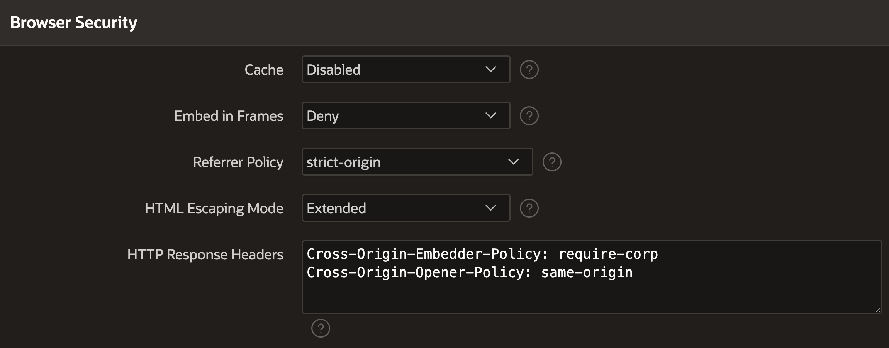

# APEX Off Grid

APEX Offline for everyone thanks to a Low Code API with Plug-Ins


[Watch this tutorial video](https://youtu.be/D9aTzsYK7MQ)

## Features

- Low Code API thanks to APEX Plug-Ins
- Data Synchronization
  - Input SQL Query -> Data gets downloaded and synced back
  - Changes get saved to local storage
  - Changes get synced back to server
  - Conflict detection and resolution possible with your own logic
- Super fast and able to handle lots of data amounts thanks to SQLite
## How to get started

### Prerequisites

- APEX >= 22.1
- Following HTTP Response Headers are required

```
Cross-Origin-Embedder-Policy: require-corp
Cross-Origin-Opener-Policy: same-origin
```

There is a setting in APEX to set these headers. [There currently is a bug](https://twitter.com/chrisneumueller/status/1649367365342093313?s=20) that results in these headers not being set on Plug-In files. So this solution **currently does not work**.



**So you need to set these headers in your Webserver or Proxy.**

[More info on the header requirement](https://sqlite.org/wasm/doc/trunk/persistence.md#:~:text=COOP%20and%20COEP%20HTTP%20Headers).

### Install sample app

1. Download ZIP file from the latest release
2. Install `1-sample-data.sql`, `2-sync-table.sql`, and the packages in `3-packages`
3. Import `f124-sample-app.sql`
4. Try it out!

### How to build your own app

1. Import Plug-Ins from release download into your app
2. [Watch this tutorial video](https://youtu.be/D9aTzsYK7MQ)

x. After you defined your storage, you have define the DML logic in the package `offline_data_sync_api`:

```sql
case when pi_row.sync_storage_id = 'people' and pi_row.sync_storage_version = 1 then
  process_people_v1(pi_row, l_success);

--
-- add more storages here refer to the example "process_people_v1" to learn how to implement your own logic
--

else
  raise_application_error(-20001, 'Unhandeled sync_storage_id or sync_storage_version => ' || pi_row.sync_storage_id || ' ' || pi_row.sync_storage_version);
  return;
end case;
```

## Caution

- This is a proof of concept
- There is no warranty or support garantee
- I am working in my free time on this
- I am not responsible for any data loss or damage
- Only a small fraction of APEX features are supported
- You can't just make your existing APEX app offline capable with this
- The users can download the Database and get control over all offline available data
- The users can manipulate the data in the local database
- Does not work with current Safari version (but in previous and next...)

## Resources

Download SQLite WASM buidl from [here](https://sqlite.org//download.html#:~:text=WebAssembly%20%26%20JavaScript)
